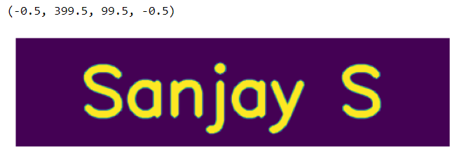
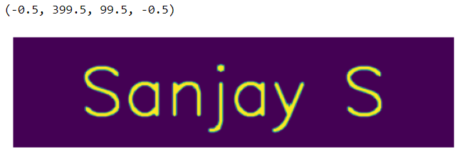
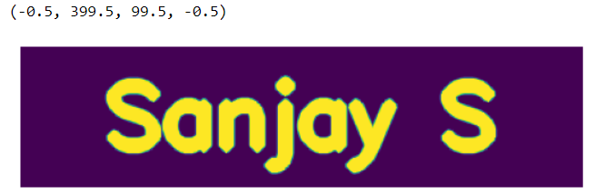

# EX 09 Implementation-of-Erosion-and-Dilation
## Aim
To implement Erosion and Dilation using Python and OpenCV.
## Software Required
1. Anaconda - Python 3.7
2. OpenCV
## Algorithm:
### Step1:<br>
Import the necessary pacakages

### Step2:<br>
Create the text using cv2.putText

### Step3:<br>
Create the structuring element

### Step4:<br>
Erode the image


### Step5: <br>
Dilate the Image

 
## Program:
```
Developed by : Sanjay S
Register Number : 212221243002
```
### Import the necessary packages
``` Python
import numpy as np
import cv2
import matplotlib.pyplot as plt
```
### Create the Text using cv2.putText
``` Python
img = np.zeros((100,400),dtype = 'uint8')
font = cv2.FONT_HERSHEY_SCRIPT_SIMPLEX
cv2.putText(img ,'Sanjay S',(60,70),font,2,(255),5,cv2.LINE_AA)
plt.imshow(img)
plt.axis('off')
```
### Create the structuring element
``` Python
kernel = np.ones((5,5),np.uint8)
kernel1 = cv2.getStructuringElement(cv2.MORPH_CROSS,(5,5))
cv2.erode(img,kernel)
```
### Erode the image
``` Python
img_erode = cv2.erode(img,kernel1)
plt.imshow(img_erode)
plt.axis('off')

```
### Dilate the image
``` Python
img_dilate = cv2.dilate(img,kernel1)
plt.imshow(img_dilate)
plt.axis('off')

```
## Output:
### Display the input Image


### Display the Eroded Image


### Display the Dilated Image


## Result
Thus the generated text image is eroded and dilated using python and OpenCV.
